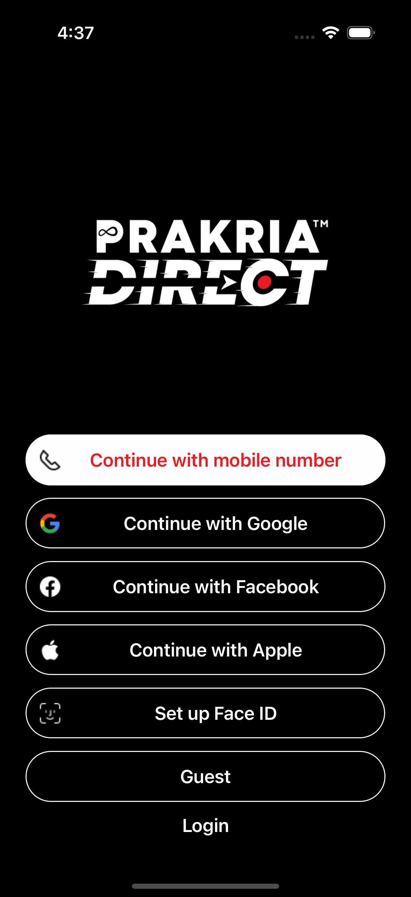
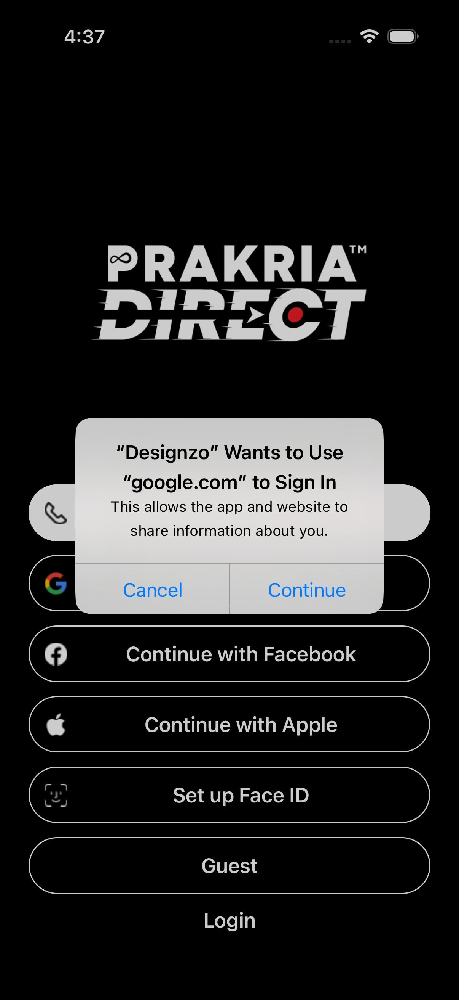

To include screenshots in your README file, follow these steps:

1. Take relevant screenshots from your **Prakria-Direct** app (e.g., login screen, dashboard, order management, product listing, etc.).
2. Save the screenshots in a folder (e.g., `/screenshots`) inside your project directory.
3. Reference them in your README file using Markdown.

Here’s how you can structure the README file with screenshots included:

---

# Prakria-Direct Mobile App

## Overview

**Prakria-Direct** is a customer-vendor mobile application built using modern technologies to provide seamless interaction between businesses and customers. The app allows customers to place orders, communicate with vendors, and track deliveries, while vendors manage orders and interact with customers.

## Technologies Used

- **React Native**: Core framework for building the cross-platform mobile app (iOS & Android).
- **Firebase Authentication**: User authentication (Email, Phone, Google Sign-In).
- **React Navigation**: Navigation between different app screens.

## Screenshots

### Customer Login Screen





## Features

### Customers

- User registration and login (via Firebase Authentication)
- Browse products/services (from Firestore)
- Place and track orders (Firestore-backed)
- In-app messaging (Firestore for real-time chats)
- Push notifications (Cloud Messaging)

### Vendors

- Manage orders and inventory (Firestore)
- Customer interaction via messaging
- Order tracking and fulfillment notifications
- Sales performance and order insights

## Installation

1. Clone the repository:  

   ```bash
   git clone https://github.com/surajprasad13/prakria-direct.git
   ```

2. Install dependencies:  

   ```bash
   cd prakria-direct  
   npm install
   ```

3. Setup Firebase:
   - Add your Firebase project’s `google-services.json` (Android) and `GoogleService-Info.plist` (iOS) in the respective directories.

4. Run the app:

   ```bash
   npx react-native run-android   // For Android
   npx react-native run-ios       // For iOS
   ```

## License

**Prakria-Direct** is licensed under the MIT License. See the [LICENSE](./LICENSE) file for details.

---
